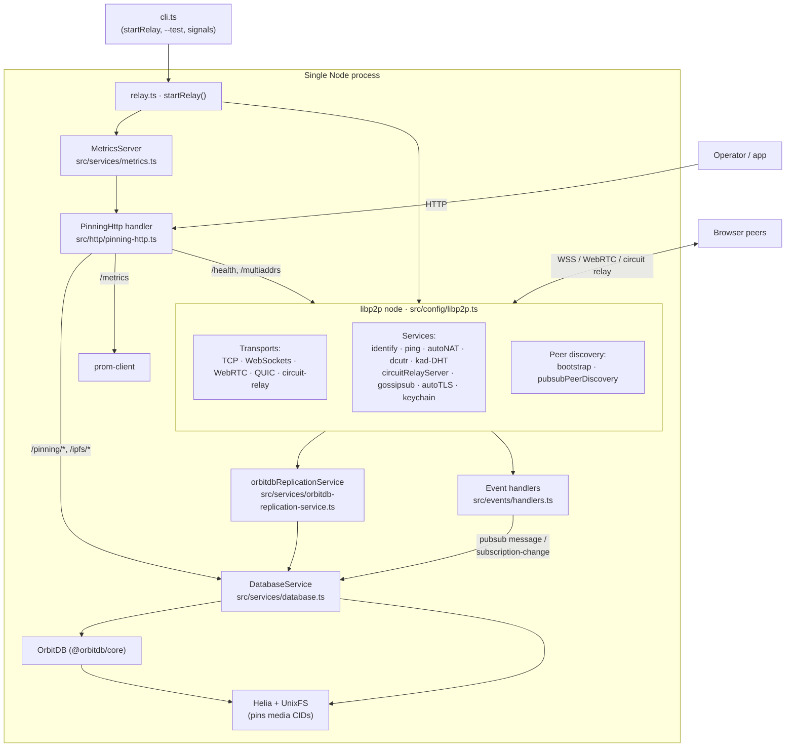

# Architecture overview

`orbitdb-relay` is a single Node process that composes four layers: a **libp2p** node for
connectivity, a **Helia** instance for IPFS blocks, an **OrbitDB** instance for database
replication, and a small **HTTP server** for health, metrics, and pinning control. This page
explains how they fit together and where each responsibility lives in the source.

## The layers

## Startup flow

`src/cli.ts` is a thin entrypoint: it loads `dotenv`, wires `SIGINT`/`SIGTERM` to a graceful stop,
and calls `startRelay({ testMode })`. The `--test` flag is the only CLI argument; everything else
is [environment configuration](../reference/environment-variables.md).

`startRelay()` in `src/relay.ts` does the real assembly:

1. **Storage** — opens a persistent `datastore` and `blockstore` under `DATASTORE_PATH` and loads
   (or generates) the relay's private key. `RELAY_PRIV_KEY` / `TEST_PRIVATE_KEY` can inject a
   deterministic key.
2. **libp2p** — builds the node from `createLibp2pConfig()` and mounts the
   `orbitdbReplicationService` (and, if enabled, the connectivity debug protocols) as libp2p
   services.
3. **Event handlers** — attaches pubsub listeners that turn network activity into sync work.
4. **HTTP** — starts the `MetricsServer`, which serves the metrics and pinning routes and wires
   AutoTLS certificates into the optional HTTPS listener.

Stopping reverses this: event handlers detach, the HTTP server closes, libp2p stops (which also
stops the replication service, OrbitDB, and Helia), then the datastore and blockstore close.

## libp2p — connectivity

`src/config/libp2p.ts` builds the node. Key choices:

- **Transports:** TCP, WebSockets, WebRTC + WebRTC-direct, QUIC, and the circuit-relay transport.
  QUIC/WebRTC/IPv6 can each be disabled with an env flag.
- **Circuit relay v2 server:** the relay reserves slots for browser peers so they can be dialed
  through it. Limits are generous by default (10× the pre-0.4 hardcoded values) and env-tunable —
  see [circuit relay env vars](../reference/environment-variables.md#circuit-relay-v2).
- **AutoTLS:** provisions a `libp2p.direct` certificate so the WebSocket listener advertises
  secure `/tls/ws` addresses. Enabled unless `disableAutoTLS` is set.
- **gossipsub:** peer scoring is deliberately neutralised (`IPColocationFactorWeight` and
  `behaviourPenaltyWeight` set to `0`). Every browser reaches the relay through the same WSS proxy,
  so they share one source IP; the default scoring would penalise co-located peers and stop
  grafting them into the mesh. See [Sync & the #1255 workaround](./sync-and-1255-workaround.md).
- **Discovery:** public IPFS/Kubo bootstrap peers (unless `RELAY_DISABLE_BOOTSTRAP`) plus
  `pubsubPeerDiscovery` on the configurable `PUBSUB_TOPICS`.
- **Amino DHT** (`/ipfs/kad/1.0.0`) for public routing, with private addresses filtered out.

## OrbitDB replication service

`orbitdbReplicationService()` (`src/services/orbitdb-replication-service.ts`) mounts as a libp2p
service and owns the replication lifecycle. It creates a **Helia** instance over the shared
datastore/blockstore, creates an **OrbitDB** instance, and observes OrbitDB pubsub activity to
schedule sync work. The heavy lifting lives in `DatabaseService` (`src/services/database.ts`):
opening databases, waiting for OrbitDB `update` events, extracting and pinning media CIDs, keeping
replicated databases open, and running the [heads re-announce mitigation](./sync-and-1255-workaround.md).

The same service is exported for [embedding in your own libp2p node](../guides/library.md).

## Event handlers — from network to sync

`src/events/handlers.ts` subscribes to libp2p pubsub:

- On a **`message`** whose topic starts with `/orbitdb/`, it queues a sync task for that database.
- On a **`subscription-change`**, it remembers the subscribing peer as an in-memory hint for that
  OrbitDB topic (used by [peer recovery](./peer-recovery.md)) and queues a sync task.

Sync tasks call `DatabaseService.syncAllOrbitDBRecords(dbAddress)`, which drives the
[media-pinning flow](./media-pinning.md).

## HTTP server — health, metrics, pinning

`MetricsServer` (`src/services/metrics.ts`) starts a plain HTTP listener on `METRICS_PORT` and,
optionally, a second HTTPS listener on `METRICS_HTTPS_PORT` using the AutoTLS PEM. Both serve the
same routes through the shared handler in `src/http/pinning-http.ts`:

- `/health`, `/multiaddrs` — liveness and dial addresses (read from libp2p).
- `/metrics` — Prometheus scrape (`prom-client`), including relay counters such as
  `orbitdb_sync_*`.
- `/pinning/*` — pinning stats, tracked databases, and the explicit `POST /pinning/sync` recovery.
- `/ipfs/<cid>` — streams pinned content (with an optional Helia network fallback).

The handler is reusable: embedded consumers can mount `createPinningHttpRequestHandler()` or the
`PinningHttpServer` wrapper. Full contract in the [HTTP API reference](../reference/http-api.md).

## Data and storage

- **Datastore + blockstore** are LevelDB-backed and caller-owned in the library case; the CLI
  places them under `DATASTORE_PATH` (default `./orbitdb/relay`) so the PeerId and libp2p state
  persist across restarts.
- **OrbitDB metadata** lives under `<DATASTORE_PATH>/orbitdb`.
- Nothing application-specific is stored outside OrbitDB itself. The relay's peer directory is
  in-memory only and lost on restart — see [Peer recovery](./peer-recovery.md).

## Where responsibilities live

| Concern | Source |
| --- | --- |
| CLI entrypoint, signals | `src/cli.ts` |
| Runtime assembly | `src/relay.ts` |
| libp2p configuration | `src/config/libp2p.ts`, `src/config/*` |
| OrbitDB replication service | `src/services/orbitdb-replication-service.ts` |
| Database open/sync/pin, heads re-announce | `src/services/database.ts` |
| Pubsub → sync task wiring | `src/events/handlers.ts` |
| Metrics + HTTPS/AutoTLS integration | `src/services/metrics.ts` |
| Shared HTTP handler | `src/http/pinning-http.ts` |
