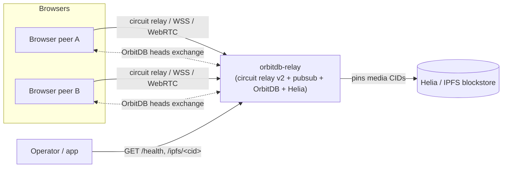

# What is orbitdb-relay?

`orbitdb-relay` is a **long-running pinner and signaling node** for apps built on
[OrbitDB](https://github.com/orbitdb/orbitdb), [Helia](https://github.com/ipfs/helia),
and [libp2p](https://libp2p.io/). It is the durable, internet-reachable peer that a
local-first, peer-to-peer app leans on when its browser peers cannot reach each other on
their own.

It does four things:

1. **Signaling & bridging** — runs a libp2p [circuit relay v2](https://github.com/libp2p/specs/blob/master/relay/circuit-v2.md)
   server plus pubsub peer discovery, so browser peers behind NAT can find and dial each other.
2. **Replication** — opens the same OrbitDB databases your app uses and lets OrbitDB's native
   sync protocol replicate the oplog into the relay.
3. **Pinning** — extracts media CIDs (for example `imageCid`) from replicated records and pins
   them in its Helia/IPFS blockstore, so content survives after the original writer goes offline.
4. **HTTP surface** — exposes `/health`, `/multiaddrs`, `/pinning/*`, `/ipfs/<cid>`, and a
   Prometheus `/metrics` endpoint from a small built-in HTTP server.

## When you need a relay

You reach for `orbitdb-relay` when the "everyone is a peer" model breaks down in practice:

- **Browser peers are behind NAT.** Two browsers usually cannot dial each other directly. A
  publicly dialable relay gives them a rendezvous point and a circuit to connect through.
- **Peers go offline.** In a purely peer-to-peer app, data that only lives in one person's
  browser disappears when they close the tab. A relay keeps a replicated copy and pins the
  referenced media.
- **You want durable media.** OrbitDB replicates the *oplog*; the images and files it references
  live in IPFS. The relay pins those CIDs so later peers can fetch them.
- **You need an operational contract.** Peer-to-peer replication is eventually consistent with no
  delivery deadline. The relay adds a bounded, observable `POST /pinning/sync` recovery path and a
  health/metrics surface you can monitor.

## What it is not

- **Not a replacement for OrbitDB replication.** OrbitDB still owns `/orbitdb/heads/*`, oplog
  merges, identities, signatures, and access control. The relay is an extra, well-behaved peer —
  see [Peer recovery](../concepts/peer-recovery.md) and the safety boundaries it respects.
- **Not a central database.** Its in-memory peer directory stores *no* application entries,
  identities, heads, or values. It is discovery metadata that is lost on restart.
- **Not an authenticated gateway by default.** `/ipfs/<cid>` is unauthenticated in the default
  relay. Expose the HTTP port only on trusted networks or put an authenticating proxy in front.

## How it fits in a local-first stack

The relay is deliberately optional and replaceable. An app can run entirely peer to peer and only
start (or point at) a relay when a team needs help connecting or keeping shared data available.

## Where to go next

- **[Quickstart](../getting-started/quickstart.md)** — get a relay running from the CLI in about
  two minutes.
- **[Architecture overview](../concepts/architecture.md)** — how libp2p, Helia, OrbitDB, and the
  HTTP server fit together.
- **[Sync & the #1255 workaround](../concepts/sync-and-1255-workaround.md)** — the OrbitDB Sync
  deadlock the relay mitigates, and why gossipsub upgrades do not fix it.
- **[HTTP API](../reference/http-api.md)** and **[Environment variables](../reference/environment-variables.md)**
  — the operational reference.
