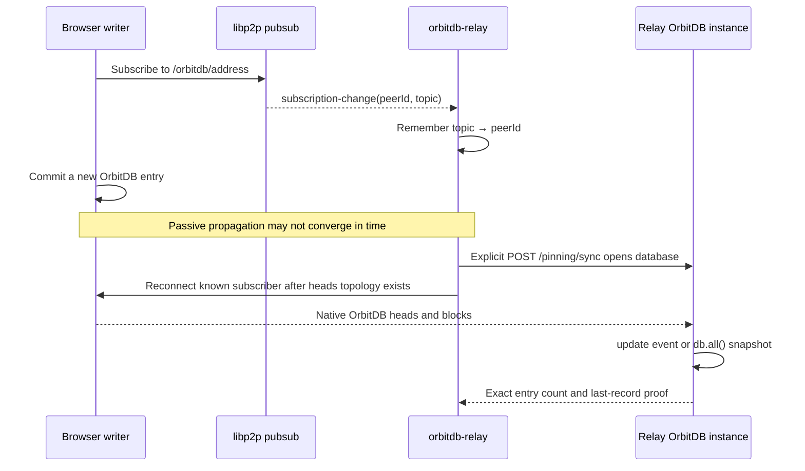

# OrbitDB peer discovery and explicit recovery

`orbitdb-relay@0.9.7` adds a small, in-memory discovery index for native OrbitDB subscribers. It solves a remote store-and-forward failure without introducing an application-specific todo-entry or identity protocol.

## Why it exists

A browser can subscribe to `/orbitdb/<manifest>` and later publish a new head while the relay already has an older snapshot open. In the failing cross-network case, the relay knew the database address and Alice's record but did not treat Bob as a source for the newer head during an explicit sync.

The replication service now retains this ephemeral relationship:

```text
OrbitDB database topic -> peer IDs observed through libp2p subscription-change
```

It is discovery metadata only. It does not contain entries, identities, heads, or blocks, and it is not persisted across relay restarts.

## Recovery flow



## Important semantics

- Normal pubsub-triggered synchronization does not disconnect peers.
- Reconnection is limited to the explicit `requireFresh` path used by `POST /pinning/sync`.
- OrbitDB registers and handles `/orbitdb/heads/...`; the relay does not copy that protocol.
- The `db.all()` fallback is valid when the new state arrived before the update listener observed an event.
- A successful HTTP response should be validated using the expected record, not only `entryCount > 0`.
- Databases with replicated state remain open so the relay can continue serving native OrbitDB heads.

## Verified result

The cross-provider `simple-todo` run [29195669726](https://github.com/NiKrause/simple-todo/actions/runs/29195669726) demonstrated:

- passive observation retained Alice's single record;
- explicit recovery reconnected the known writer;
- the relay snapshot advanced from one to two records;
- the exact Bob record became `lastRecord`;
- Alice then observed Bob's record;
- a subsequent Alice-to-Bob update replicated live in 308 ms.

This validates the recovery mechanism. It does **not** close the remaining issue of reliable passive writer-to-relay convergence.
