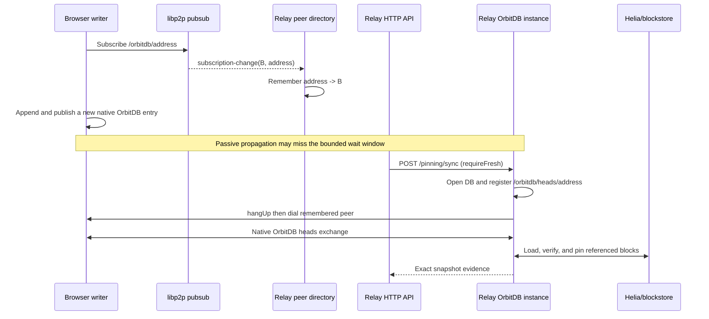

# OrbitDB peer directory, native heads reconnect, and explicit recovery

This document describes the recovery mechanism introduced in
`orbitdb-relay@0.9.7`. It explains why the relay keeps an ephemeral peer
directory, why an explicit sync may reconnect a peer, and which parts are
provided by OrbitDB itself.

The short version is:

> OrbitDB still performs all database replication. The relay only remembers
> which peers announced interest in a database and recreates the connection
> conditions under which OrbitDB's native heads protocol can run.

No application entry, identity, head, or block is copied through a custom
relay protocol.

## The problem this solves

`orbitdb-relay` is not a normal application peer that opens a fixed list of
databases at startup. It is a long-running discovery and pinning service that
may learn an arbitrary OrbitDB address from network activity and open that
database only afterwards.

That difference creates an ordering problem:

1. A browser already has a database open and subscribes to its
   `/orbitdb/<manifest CID>` pubsub topic.
2. The relay observes the subscription before it has opened that database.
3. Opening the database later registers OrbitDB's database-specific
   `/orbitdb/heads/<address>` handler and starts its sync instance.
4. The original subscription-change event is historical by then. A later
   pubsub notification is not guaranteed to arrive within the pinning or test
   deadline.
5. The relay can therefore hold an older valid snapshot even though a
   connected browser has a newer head.

This appeared in the cross-provider test as a concrete store-and-forward
failure: Alice's entry was present on the relay, Bob appended a second entry,
but the relay did not passively advance to Bob's head before Alice tried to
receive it.

## What OrbitDB 4 already provides

OrbitDB already contains the actual replication protocol. Its
[`Sync` implementation](https://github.com/orbitdb/orbitdb/blob/v4.0.0/src/sync.js)
does the following for every **open database with synchronization enabled**:

- subscribes to the database address as a pubsub topic;
- listens for pubsub `subscription-change` events;
- registers `/orbitdb/heads/<database address>`;
- exchanges current log heads with another database peer;
- publishes newly appended entries on the database topic;
- joins received entries into the local oplog; and
- removes a peer from the sync peer set when the libp2p connection closes, so
  a later connection can synchronize again.

OrbitDB describes this model as eventually consistent. Its own source also
states that it does not guarantee message delivery or a time by which a
message must arrive. That is appropriate for peer-to-peer database clients,
but an HTTP pinning operation needs a bounded and observable result.

## What OrbitDB does not provide

The recovery layer is not a second database protocol and should not be read as
one. It supplies deployment-specific orchestration that is outside OrbitDB's
core responsibility:

| Capability | OrbitDB 4 | `orbitdb-relay` |
| --- | --- | --- |
| Replicate oplog heads and entries | Yes | Delegates to OrbitDB |
| Fetch referenced blocks through Helia | Yes | Uses the same Helia blockstore and pins results |
| Synchronize a database that is already open | Yes | Keeps successfully replicated databases open |
| Discover arbitrary database addresses before opening them | No general database directory | Observes `/orbitdb/*` pubsub activity |
| Remember which peer announced an unopened database | No cross-database service index | Ephemeral topic-to-peer directory |
| Expose bounded operational recovery over HTTP | No | `POST /pinning/sync` |
| Report a snapshot suitable for deployment/test assertions | No pinning HTTP contract | Returns relay sync evidence |

This is therefore an integration gap caused by the relay's dynamic lifecycle,
not evidence that OrbitDB lacks replication. A normal pair of clients that
open the same address while their pubsub and libp2p paths are healthy should
use OrbitDB synchronization without this recovery endpoint.

## Component 1: the peer directory

The replication service listens to libp2p pubsub `subscription-change`
events. For subscriptions whose topic starts with `/orbitdb/`, it records:

```text
OrbitDB database topic -> peer IDs observed subscribing to that topic
```

The implementation is `DatabaseService.knownDatabasePeers`, populated by
`rememberDatabasePeer()`.

The directory has deliberately narrow semantics:

- It is discovery metadata, not a database catalogue or source of truth.
- It stores no entries, identities, heads, CAR files, or application values.
- It is in memory and is lost when the relay restarts.
- A peer in the directory is only a candidate source; it is not proof that the
  peer still has the database or its newest head.
- Database authenticity and write authorization remain enforced by OrbitDB's
  manifest, identities, signatures, and access controller.

Remembering the association closes the temporal gap between "peer announced
the database" and "relay finished opening the database".

## Component 2: native OrbitDB heads reconnect

During an explicit fresh sync, the relay first opens or retains the requested
database. This is important because opening creates the native OrbitDB sync
instance and registers the database-specific heads handler.

The relay then reconnects peers remembered for that database by calling
libp2p `hangUp(peer)` followed by `dial(peer)`. It does **not** open a custom
todo stream and it does not send serialized OrbitDB entries itself.

The new connection has two useful effects:

1. OrbitDB's `peer:disconnect` listener removes the old peer from that
   database sync instance's peer set.
2. libp2p Identify/topology and pubsub subscription state are observed again
   after the `/orbitdb/heads/<address>` handler exists.

OrbitDB can then run its normal bidirectional heads exchange. Missing oplog
entries and blocks continue to be verified and loaded by OrbitDB/Helia.

Calling this a **native heads reconnect** means that the reconnect is an
orchestration trigger for OrbitDB's existing protocol. It does not mean that
the relay has reimplemented `/orbitdb/heads/*`.

## Component 3: explicit recovery through `/pinning/sync`

`POST /pinning/sync` selects the `requireFresh` synchronization path. The
operation:

1. validates and loads the OrbitDB manifest;
2. opens any OrbitDB access-controller database needed for verification;
3. opens or retains the requested database;
4. reconnects candidate peers remembered for that database;
5. waits for OrbitDB update/join activity;
6. inspects the resulting store, with `db.all()` as a fallback when state
   arrived before the update listener was attached;
7. pins referenced content through the relay's Helia blockstore; and
8. returns structured evidence such as the address, entry count, last record,
   and snapshot source.

Example:

```bash
curl -sS -X POST "https://relay.example/pinning/sync" \
  -H "content-type: application/json" \
  --data '{"dbAddress":"/orbitdb/REPLACE_WITH_MANIFEST_CID"}'
```

The caller should assert the expected record or head, not merely
`entryCount > 0`: an old but non-empty relay snapshot is not proof of fresh
convergence. See the [HTTP API reference](http-api.md#post-pinningsync) for the
complete request and response contract.

## End-to-end sequence



## Normal path versus recovery path

The normal path remains preferable:

- OrbitDB peers stay connected.
- New entries propagate over the native database pubsub topic.
- The relay does not disconnect peers during pubsub-triggered synchronization.

The recovery path is intentionally limited to an explicit fresh sync:

- it may briefly interrupt other streams sharing the same peer connection;
- it adds network and Identify/pubsub churn;
- it is a bounded operational repair, not the steady-state replication model;
- it depends on an in-memory hint that may be absent after a relay restart.

Databases that have produced replicated state remain open so the relay can
continue serving native heads and avoid recreating the late-open race for
every update.

## Safety and protocol boundaries

The following invariants are intentional and covered by the relay design:

- OrbitDB owns `/orbitdb/heads/*` and all oplog merge behavior.
- The relay must not introduce a todo-entry, identity-block, or other
  application-specific replication protocol.
- A directory entry never grants write access and is never accepted as data.
- The database address determines the manifest being opened; the database
  name alone is not used as identity.
- Successful recovery must be demonstrated using the expected application
  record and the resulting OrbitDB snapshot.

## Verified outcome and remaining limitation

The cross-provider `simple-todo` runs
[29195669726](https://github.com/NiKrause/simple-todo/actions/runs/29195669726)
and
[29196381831](https://github.com/NiKrause/simple-todo/actions/runs/29196381831)
demonstrated the recovery sequence:

- Alice's existing record was visible on the relay;
- Bob appended a distinct second record;
- explicit recovery reconnected the remembered writer;
- the relay snapshot advanced to the exact Bob record;
- Alice received Bob's record from the recovered native OrbitDB state; and
- a later Alice-to-Bob update replicated live.

This proves the explicit recovery mechanism and bidirectional remote
replication. It does **not** prove reliable passive writer-to-relay convergence
in every topology. That remaining objective is tracked in
[`orbitdb-relay#10`](https://github.com/NiKrause/orbitdb-relay/issues/10). The
preferred future result is to make the normal OrbitDB path reliable enough
that tests and applications do not need to call the recovery endpoint.

## Code map

- `src/services/orbitdb-replication-service.ts`: observes OrbitDB pubsub
  subscriptions and schedules database synchronization.
- `src/services/database.ts`: stores peer hints, opens databases, reconnects
  known peers on `requireFresh`, waits for native updates, and records proof.
- `src/http/pinning-http.ts`: exposes `POST /pinning/sync`.
- `docs/http-api.md`: documents the HTTP contract.
- `docs/relay-media-pinning.md`: describes database and media pinning.
